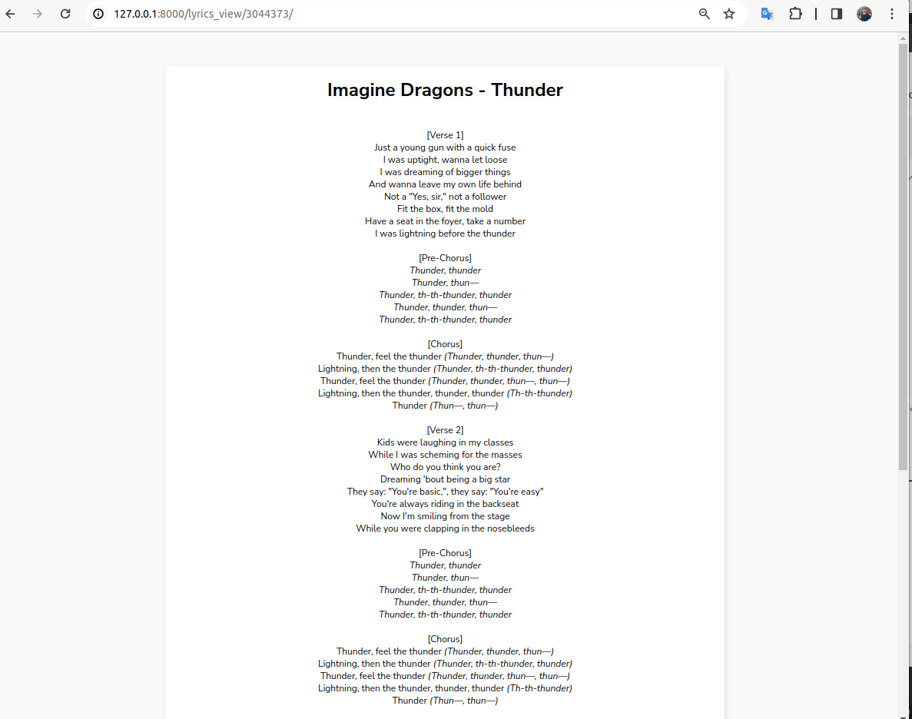

# genius_api_django_project
  
The Genius API was used for the project. (https://genius.com/)  
  
If you want to try to build by your own or test my project,
get a free api you can here - https://rapidapi.com/Glavier/api/genius-song-lyrics1/pricing  

## UPDATED: 
- updated design
- made several improvements
- added new feature - after getting search result you can click on 'View' link that stands near every popular track and go to lyrics directly  
  
## How it works:  
  
  
### Home page  
On the home page, enter any artist or band.  

### Search result  
After searching, the program will give you the top popular tracks by artist.  
Just copy the track ID and go to the page "Get lyrics by track id" or click "View" next to each track  
  

### Click "View"  
You can go directly to the lyrics    
  

  
### Get Lyrics Page  
Also you can click "Get lyrics by track id" (bottom)  
And enter the track ID and see the lyrics  
  

### Get Lyrics Page Result
  
  

  
