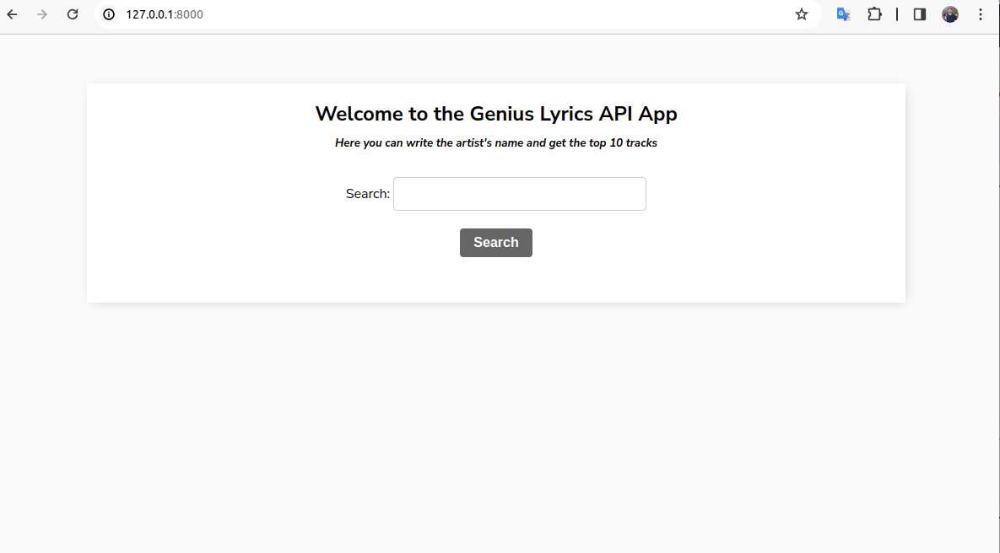
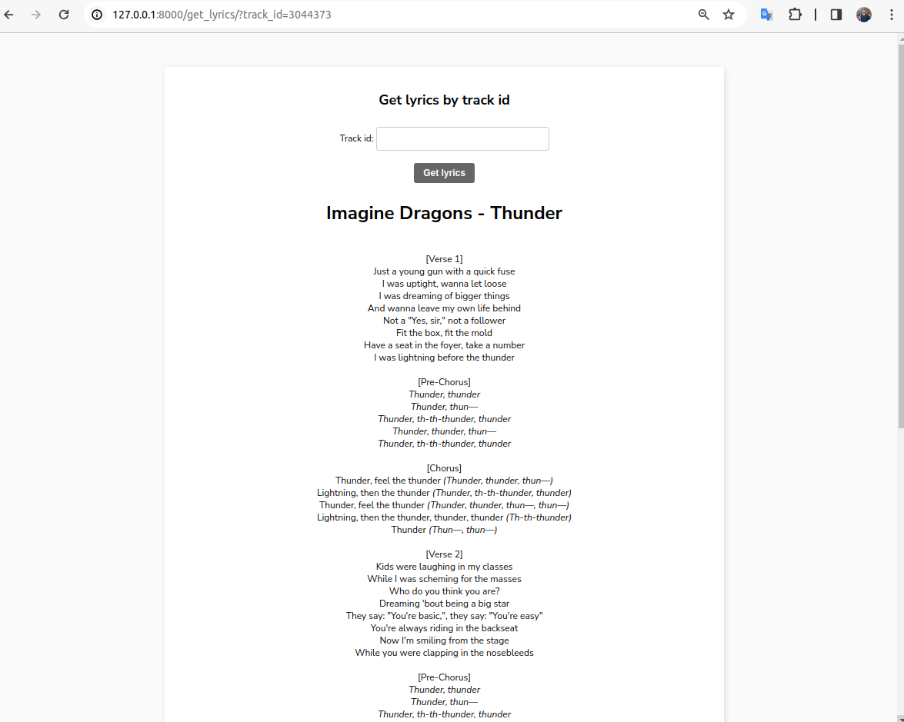

# genius_api_django_project

## A small mini-project.
The Genius API was used for the project. (https://genius.com/)  
  
If you want to try to build by your own or test my project,
get a free api you can here - https://rapidapi.com/Glavier/api/genius-song-lyrics1/pricing  

## UPDATED: 
added new feature - after getting search result you can click on link that stands near every popular track and go to lyrics directly  
  
## How it works:  
  
  
### Home page  
On the home page, enter any artist or group.  

### Search result  
After searching, the program will give you the top popular tracks by artist.  
Just copy the track ID and go to the page "Get lyrics by track id". 
  

### Get Lyrics Page  
Enter your ID and see the lyrics  
  

### Get Lyrics Page Result
  

